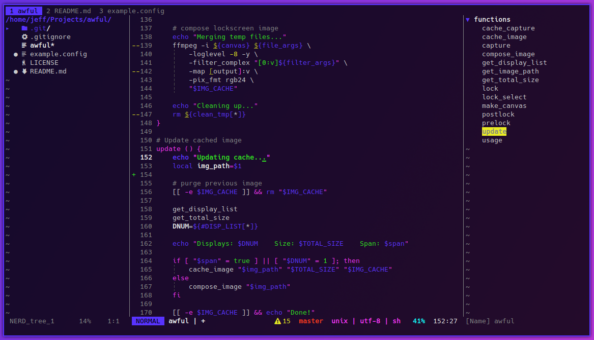

# antsy.vim



Vim syntax and color scheme.

Requires NERDTree, BufTabLine, lightline.vim, & vim-devicons.

### Install
Run
```
sh -c "$(curl -fsSL https://raw.githubusercontent.com/jeffmhubbard/dotfiles/master/extras/vim_setup.sh)"
```
to install Pathogen, antsy.vim, and other needed plugins.

Grab my [vimrc](https://raw.githubusercontent.com/jeffmhubbard/dotfiles/master/src/.vim/vimrc) too.
